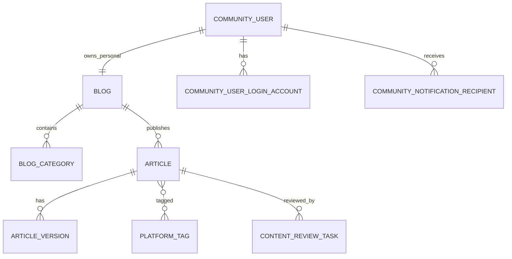

# 博客社区工程文档完整合并版

> 由工程文档包 v0.3 自动合并。专题文件仍是维护源。


---

# 00 技术栈与工程基线

> 文档版本：v0.3  
> 项目代号：`pxczxn-community`  
> 后台基础工程：`pxczxn-admin`。原始脚手架来源为 Mars Admin，仅保留来源记录；工程命名、包名、模块名和产品品牌均归属 `pxczxn`。  
> 当前阶段：模块化单体，优先完成 V1 核心闭环。

---

## 1. 技术选型原则

项目技术选型遵循以下原则：

1. **业务优先**：先完成注册、个人博客、文章编辑、审核和发布闭环，不为了展示技术而堆基础设施。
2. **模块化单体优先**：V1 不拆微服务，不引入 Spring Cloud、服务注册中心和分布式事务。
3. **复用成熟能力**：后台管理、RBAC、文件、日志和定时任务优先复用 `pxczxn-admin` 已有实现。
4. **品牌与脚手架分离**：`pxczxn-admin` 是本项目后台基础工程，项目对外和工程内部统一使用 `pxczxn` 命名。
5. **MySQL 是事实来源**：核心业务数据必须落 MySQL；Redis 仅承担缓存、会话、限流、计数和锁等增强职责。
6. **可替换但不滥换**：核心技术一旦进入开发阶段，不因“某个库更火”就随意替换。
7. **先可维护，再谈规模化**：只有出现真实流量、并发和多实例需求后，才增加搜索引擎、消息队列等组件。

---

## 2. 总体架构

```text
pxczxn-community
├── pxczxn-backend       Java 后端，基于 `pxczxn-admin` 工程开发
├── pxczxn-web           普通用户端与公开博客页面
├── pxczxn-admin         平台运营管理端
├── database             版本化 SQL、初始化数据与数据库说明
├── deploy               Docker Compose、Nginx 与部署配置
└── docs                 产品、架构、接口和任务文档
```

系统采用：

```text
前后端分离
+ 模块化单体后端
+ 独立用户端前端
+ 独立管理端前端
+ MySQL 核心存储
+ Redis 可选增强
```

### 2.1 运行关系

```text
pxczxn-web
      │
      ├── /api/v1/**
      ▼
pxczxn-backend
      ▲
      ├── /admin-api/**
      │
pxczxn-admin

pxczxn-backend ── MySQL
pxczxn-backend ── Redis（增强能力）
pxczxn-backend ── 本地 / MinIO / OSS（文件存储）
```

---

## 3. 工程命名规范

### 3.1 项目与仓库

```text
项目根名称：pxczxn-community
后端目录：pxczxn-backend
用户端：pxczxn-web
管理端：pxczxn-admin
```

未来正式品牌确定后，可以修改页面标题、Logo、域名和展示文案，但不要求立即重命名所有底层代码。

### 3.2 Java 包名

统一使用：

```java
top.pxczxn.community
```

示例：

```text
top.pxczxn.community.user
top.pxczxn.community.blog
top.pxczxn.community.article
top.pxczxn.community.moderation
```

### 3.3 Maven 模块

目标模块命名：

```text
pxczxn-common
pxczxn-infra
pxczxn-system
pxczxn-auth
pxczxn-file
pxczxn-biz
pxczxn-admin-api
pxczxn-web-api
pxczxn-job
pxczxn-starter
```

若工程仍保留原脚手架目录，可以分阶段重命名；所有新增业务代码统一使用 `pxczxn` 命名。

### 3.4 Token 与配置前缀

```text
管理员 Token：pxczxn-admin-token
社区用户 Token：pxczxn-community-token
配置前缀：pxczxn.community
```

### 3.5 数据库命名

建议数据库名：

```text
pxczxn_community
```

后台系统表可以保留中性的 `sys_` 前缀；社区业务表使用明确的领域名称，例如：

```text
community_user
blog
article
article_version
comment
content_like
content_favorite
```

新业务表不使用旧脚手架品牌前缀。

---

## 4. 后端技术栈

### 4.1 Java 与构建

| 项目 | 选型 |
|---|---|
| Java | **Java 21** |
| 构建工具 | Maven Wrapper 优先 |
| 编码 | UTF-8 |
| 时间存储 | UTC |

要求：

- 所有后端模块统一使用 Java 21。
- 本地、CI 和服务器使用相同的 Java 主版本。
- 仓库保留 Maven Wrapper，避免开发环境 Maven 版本漂移。
- 不在部分模块中继续使用 Java 17 编译目标。

### 4.2 核心框架

| 领域 | 技术 |
|---|---|
| 后台基础工程 | `pxczxn-admin` |
| Web 框架 | Spring Boot 3.x |
| 核心容器 | Spring Framework 6.x |
| 数据访问 | MyBatis-Plus |
| 认证鉴权 | Sa-Token |
| 参数校验 | Jakarta Bean Validation |
| 定时任务 | Quartz |
| API 文档 | Springdoc OpenAPI |
| 对象转换 | 沿用脚手架现有方式，优先 MapStruct |

### 4.3 `pxczxn-admin` 的使用边界

`pxczxn-admin` 负责提供：

- 管理员登录和 RBAC
- 菜单、角色与权限标识
- 系统配置与字典
- 操作日志和登录日志
- 文件管理基础能力
- Quartz 定时任务基础
- 通用响应、异常和 CRUD 脚手架

`pxczxn-admin` **不决定**：

- 项目品牌名称
- 社区用户模型
- 博客和文章业务权限
- 团队角色模型
- 文章审核和版本流程
- 前台页面设计

### 4.4 管理员与社区用户隔离

系统保留两套账号体系：

```text
平台管理员
→ sys_user / 后台 RBAC

社区用户
→ community_user / 业务关系权限
```

管理员和社区用户：

- 使用不同 Token 名称；
- 使用不同登录入口；
- 使用不同权限判断；
- 不能通过一套 Token 直接访问另一套接口；
- 社区用户不能进入管理后台；
- 管理员也不能自动冒充社区用户。

### 4.5 后端领域模块

社区业务集中于 `pxczxn-biz`，内部按领域分包：

```text
top.pxczxn.community
├── user
├── blog
├── article
├── taxonomy
├── series
├── moment
├── interaction
├── follow
├── favorite
├── submission
├── collaboration
├── moderation
├── notification
├── operation
└── shared
```

V1 不把每个领域拆成独立 Maven 模块，避免模块数量膨胀。

### 4.6 业务事件

V1 使用：

```text
Spring ApplicationEvent
@TransactionalEventListener
```

适用于：

- 发布文章后发送通知；
- 审核完成后更新状态；
- 更新统计与缓存；
- 清理搜索数据；
- 记录业务事件。

V1 不引入 Kafka 或 RabbitMQ。

---

## 5. 数据库与 SQL 管理

### 5.1 主数据库

| 项目 | 选型 |
|---|---|
| 数据库 | MySQL 8.x |
| 存储引擎 | InnoDB |
| 字符集 | utf8mb4 |
| 时间字段 | DATETIME(3)，统一保存 UTC |
| 主键 | BIGINT，由后端生成 |

MySQL 是以下数据的唯一事实来源：

- 用户与登录账号；
- 个人博客与团队博客；
- 文章、正文版本和发布状态；
- 分类、标签和系列；
- 评论、关注、点赞和收藏关系；
- 投稿、共创和转载关系；
- 审核、举报、处罚和申诉记录；
- 通知记录和重要审计数据。

### 5.2 数据库变更方式

项目**不使用 Flyway**。

使用仓库内版本化 SQL 脚本：

```text
database/
├── README.md
├── migrations/
│   ├── V001__init_core_schema.sql
│   ├── V002__add_article_version.sql
│   ├── V003__add_review_tables.sql
│   └── V004__add_indexes.sql
├── seeds/
│   ├── dev_seed.sql
│   └── base_dictionary.sql
└── rollback/
    └── 按需提供高风险变更回滚脚本
```

每个迁移脚本必须写明：

- 版本号和用途；
- 依赖的前置版本；
- 是否会锁表；
- 是否会修改或迁移历史数据；
- 是否需要备份；
- 是否可重复执行；
- 执行后的验证 SQL。

`database/README.md` 维护：

- 当前数据库版本；
- 新环境初始化顺序；
- 已部署环境升级顺序；
- 执行记录；
- 失败处理方式。

V1 可以人工执行或由部署脚本顺序执行 SQL，不额外引入迁移框架。

### 5.3 数据原则

- 所有重要关系在数据库层建立唯一约束；
- 文章正文只存于版本表；
- 公开版本和编辑版本分离；
- 用户名、slug 和标题不能作为外键；
- 核心关系不塞进 JSON；
- 审核、举报和处罚记录不允许普通业务物理删除。

---

## 6. Redis

### 6.1 定位

Redis 可以接入，但属于增强组件：

```text
MySQL = 业务事实来源
Redis = 会话、缓存、限流、计数和锁
```

项目可以在 V1 使用 Redis，但不得把核心业务绑死在 Redis 上。

### 6.2 适合使用的场景

- Sa-Token 登录会话；
- 邮箱验证码；
- 接口限流；
- 防重复提交；
- 临时预览 Token；
- 热门文章和公开页面缓存；
- 未读通知数量；
- 浏览量等高频计数缓冲；
- 定时发布锁；
- 多实例部署后的分布式锁。

### 6.3 禁止作为唯一存储

以下数据不能只存在 Redis：

- 账号和密码凭证；
- 文章正文与版本；
- 点赞、收藏和关注关系；
- 团队成员和角色；
- 审核结果和文章状态；
- 举报、处罚和申诉记录。

### 6.4 使用约束

业务代码不在各处直接调用 `RedisTemplate`，统一通过抽象服务：

```text
CacheService
RateLimitService
LockService
CounterService
VerificationCodeService
```

Redis 不可用时：

- 已发布文章仍可访问；
- 核心数据不得丢失；
- 缓存可以回源 MySQL；
- 非关键限流和计数允许降级；
- 发布、审核和权限判断仍以数据库为准。

---

## 7. 用户端前端

### 7.1 核心技术

| 领域 | 技术 |
|---|---|
| 框架 | Next.js |
| UI 基础 | React |
| 语言 | TypeScript |
| 样式 | Tailwind CSS |
| 包管理 | pnpm |
| Node.js | 使用 LTS 版本，并通过 `.nvmrc` 或 Volta 锁定 |

用户端项目名称：

```text
pxczxn-web
```

### 7.2 用户端职责

- 首页和发现；
- 搜索；
- 个人博客和团队博客主页；
- 文章、系列、标签和动态页面；
- 注册登录；
- 创作工作台；
- 富文本与 Markdown 编辑；
- 通知和个人设置；
- 团队工作台。

### 7.3 渲染策略

公开内容优先使用 Next.js 的服务端渲染、缓存或静态生成能力：

- 博客主页；
- 文章详情；
- 标签和系列页面；
- SEO 元数据；
- Sitemap 与 RSS。

登录后的编辑器和管理工作台以客户端交互为主。

### 7.4 请求与状态

- 默认使用标准 `fetch` 封装 API 客户端；
- 无明确必要时不额外引入 Axios；
- 服务端状态与本地 UI 状态分离；
- 不把全部接口数据塞进一个全局 Store；
- BIGINT ID 始终按字符串处理。

---

## 8. 管理端前端

管理端项目名称：

```text
pxczxn-admin
```

`pxczxn-admin` 管理前端沿用现有技术：

| 领域 | 技术 |
|---|---|
| 框架 | Vue 3 |
| 语言 | TypeScript |
| 构建 | Vite |
| UI | Naive UI |
| 状态管理 | Pinia |
| 路由 | Vue Router + 动态菜单 |

管理端只服务平台运营人员，负责：

- 社区用户和博客管理；
- 团队博客申请；
- 文章、动态、评论和系列审核；
- 标签、专题和推荐位；
- 举报、处罚和申诉；
- 公告、关键词和系统配置；
- 文件、日志和统计。

不使用 React 或 Next.js 重写管理端。

---

## 9. 编辑器与内容渲染

### 9.1 富文本编辑器

```text
Tiptap / ProseMirror
```

作为普通用户默认编辑模式。

富文本文章的真实来源为结构化 JSON，不以 HTML 作为唯一源数据。

### 9.2 Markdown 编辑器

```text
CodeMirror 6
```

作为高级写作模式，适合技术作者和长文档。

### 9.3 Markdown 处理链

```text
unified
remark
mdast
rehype
```

负责：

- Markdown 解析；
- 目录生成；
- 安全 HTML 输出；
- 链接、图片和自定义语法处理。

### 9.4 代码与公式

| 能力 | 技术 |
|---|---|
| 代码高亮 | Shiki |
| 数学公式 | KaTeX |

### 9.5 内容安全

- 不允许任意脚本和事件属性；
- 不允许未经清洗的 HTML；
- iframe 使用严格白名单；
- 服务端重新校验和渲染正文；
- HTML 是展示缓存，不是文章唯一源数据。

---

## 10. 文件与对象存储

复用脚手架已有文件能力，按部署环境选择：

```text
本地存储
MinIO
兼容 S3 的对象存储
云厂商 OSS
```

业务表和正文只保存 `file_id`，不保存 Base64，也不把完整 URL 当作永久业务标识。

V1 支持：

- JPG、PNG、WebP、GIF；
- 经严格清洗的 SVG；
- 白名单文档附件。

V1 不提供平台原生视频上传和转码，视频先使用外部链接卡片。

---

## 11. 搜索

### 11.1 V1

使用 MySQL 完成基础搜索：

- 标题；
- 摘要；
- 正文纯文本；
- 标签；
- 作者与博客名称；
- 系列名称。

可以根据实际效果评估 MySQL FULLTEXT，但不作为必须条件。

### 11.2 后续扩展

只有在内容数量和搜索需求明显增长后，再评估：

```text
OpenSearch
Elasticsearch
```

搜索引擎不作为 V1 启动依赖。

---

## 12. 测试技术

### 12.1 后端

| 类型 | 技术 |
|---|---|
| 单元测试 | JUnit 5 |
| Spring 集成测试 | Spring Boot Test |
| Mock | Mockito |
| API 测试 | MockMvc |
| 真实数据库测试 | Testcontainers，按需使用 |

重点覆盖：

- 注册事务；
- 管理员与社区用户隔离；
- 文章权限；
- 文章版本；
- 审核和发布状态机；
- 定时发布；
- 数据唯一约束。

### 12.2 前端

| 类型 | 技术 |
|---|---|
| 单元与组件测试 | Vitest |
| React 组件测试 | React Testing Library |
| 端到端测试 | Playwright |

核心 E2E：

```text
注册
→ 自动创建个人博客
→ 创建文章
→ 保存草稿
→ 提交审核
→ 后台审核
→ 公开访问文章
```

---

## 13. API 与工程规范

### 13.1 API 前缀

```text
用户端：/api/v1/**
管理端：/admin-api/**
```

### 13.2 API 文档

使用 Springdoc OpenAPI，并将用户端和管理端接口分组。

### 13.3 接口规则

- Controller 不直接调用 Mapper；
- Controller 不承担复杂权限和事务；
- 资源权限由专门 PermissionService 判断；
- 错误码按业务领域划分；
- 所有 BIGINT ID 在 JSON 中按字符串返回；
- 所有写操作考虑幂等和并发冲突。

---

## 14. 日志与可观测性

V1 沿用 Spring Boot 与脚手架日志体系：

- 应用日志；
- 管理员操作日志；
- 登录日志；
- 审核和处罚日志；
- 定时任务日志；
- 业务异常日志。

日志中禁止输出：

- 明文密码；
- 完整 Token；
- 验证码；
- 完整手机号和身份凭据；
- 私密文章正文。

后续可按实际需要接入：

```text
Spring Boot Actuator
Prometheus
Grafana
Sentry
```

这些不作为 V1 强制依赖。

---

## 15. 部署技术

### 15.1 V1 推荐部署

```text
Linux
Docker Compose
Nginx
MySQL
Redis
Java 后端
pxczxn-web
pxczxn-admin
本地存储或 MinIO
```

Redis 可以启用；如果部署资源有限，也可以在初期关闭非必要缓存能力。

### 15.2 Nginx 职责

- HTTPS；
- 反向代理；
- 用户端和管理端域名分流；
- 静态资源缓存；
- 上传大小限制；
- 基础安全响应头。

### 15.3 环境配置

至少区分：

```text
local
开发者本地

dev
联调环境

prod
正式环境
```

密钥和密码不得写入仓库。

---

## 16. V1 明确不引入

- Spring Cloud；
- 微服务和服务注册中心；
- Kubernetes；
- Kafka；
- RabbitMQ；
- MongoDB；
- 图数据库；
- Elasticsearch / OpenSearch 强依赖；
- Flyway 和 Liquibase；
- 实时多人协作编辑；
- WebSocket 自由聊天系统；
- 原生视频转码；
- 支付、钱包和分账；
- 自研 ORM；
- 自研认证框架。

---

## 17. 技术栈总表

| 领域 | 技术与决定 |
|---|---|
| 项目代号 | `pxczxn-community` |
| Java 包名 | `top.pxczxn.community` |
| 后端语言 | Java 21 |
| 后端基础 | 基于 `pxczxn-admin` 工程开发 |
| 后端框架 | Spring Boot 3.x |
| 数据访问 | MyBatis-Plus |
| 身份认证 | Sa-Token，多账号体系 |
| 构建工具 | Maven Wrapper |
| 主数据库 | MySQL 8.x |
| SQL 迁移 | 仓库内版本化 SQL，不使用 Flyway |
| Redis | 可选增强：会话、缓存、限流、计数和锁 |
| 定时任务 | Quartz |
| 业务事件 | Spring ApplicationEvent |
| 用户端 | Next.js + React + TypeScript |
| 用户端样式 | Tailwind CSS |
| 用户端包管理 | pnpm |
| 管理端 | Vue 3 + TypeScript + Vite |
| 管理端 UI | Naive UI |
| 富文本编辑器 | Tiptap / ProseMirror |
| Markdown 编辑器 | CodeMirror 6 |
| Markdown 处理 | unified + remark + rehype |
| 代码高亮 | Shiki |
| 数学公式 | KaTeX |
| 文件存储 | 本地 / MinIO / OSS |
| 搜索 | V1 使用 MySQL，后期再评估搜索引擎 |
| 后端测试 | JUnit 5 + Spring Boot Test + Mockito |
| 前端测试 | Vitest + Playwright |
| 部署 | Docker Compose + Nginx |
| 架构 | 前后端分离的模块化单体 |

---

## 18. 最终技术定位

```text
Java 21 + Spring Boot 3 + MyBatis-Plus + Sa-Token
负责社区业务与平台接口

pxczxn-admin
只作为后台和基础能力脚手架

Next.js + TypeScript + Tailwind CSS
负责普通用户端和公开博客

Vue 3 + Naive UI
负责平台运营管理端

MySQL
负责全部核心业务数据

Redis
负责会话、缓存、限流、计数和锁等增强能力
```

项目当前坚持：

> `pxczxn-admin` 是项目唯一后台工程名称；原始脚手架来源只作为技术来源记录。

> V1 先把模块化单体做稳，再根据真实用户量决定是否增加新的基础设施。


---

# 01 产品定位、范围与路线图

## 1. 产品定位

平台定位为：

> 免费、开放但有秩序的博客社区。

核心体验：

```text
注册账号 = 获得一个个人博客
```

个人博客不是附属空间，而是用户唯一公开主页。社区负责连接不同个人博客和团队博客，提供发现、互动、关注、投稿、共创和内容治理能力。

## 2. 目标用户

- 技术作者与项目开发者
- 学生和学习记录者
- 写作爱好者
- 设计师、创作者和团队
- 希望拥有长期内容主页的普通用户

平台不局限于技术内容，因此默认编辑器必须对普通用户友好。

## 3. V1 必须完成

### 用户与博客

- 注册、登录、退出和账号安全
- 注册后自动创建个人博客
- 个人博客主页与基础设置
- 团队博客申请、成员和角色

### 内容

- 富文本与 Markdown 编辑
- 草稿、版本、预览、审核和发布
- 文章分类、平台标签和系列
- 动态、自定义页面、投稿和共创
- 站内转载、引用与唯一原文

### 社区互动

- 关注、粉丝、互关和特别关注
- 评论、回复和评论点赞
- 文章/动态点赞、收藏和收藏夹
- 分享、转发、引用和转载
- 举报、屏蔽、申诉和站内通知

### 平台能力

- 首页、发现、搜索和规则推荐
- 文件上传和安全处理
- SEO、RSS 和公开访问
- 作者基础数据
- `pxczxn-admin` 运营管理后台

## 4. V1 暂不实现

- 自由私信和群聊
- 原生视频上传、直播和小程序
- 付费文章、会员、广告、打赏和收益分成
- 钱包、提现、订单、支付和税务结算
- 实时多人协同编辑
- AI 自动写作和复杂 AI 推荐模型
- 开放 API、插件市场和自由主题代码
- 多语言和原生移动 App

## 5. 商业模式

V1 及可预见阶段不收费。

不通过限制正常功能制造付费点，不开发支付、钱包和结算模块。未来只有出现明确、合法且可持续的收入来源后，才重新评估商业化。

## 6. 阶段路线图

### M1：基础发布闭环

```text
注册 → 自动创建个人博客 → 写文章 → 提交审核 → 发布 → 公开访问
```

### M2：社区互动

关注、评论、点赞、收藏、通知和动态。当前已完成。

### M2.5：产品语义与信息架构校正

真实发现页、登录回跳、统一博客端导航、参数化内容/团队/协作路由、管理端社区运营中心与运行时演示文案清理。排序必须可解释，不得把编辑精选、最新、互动热度或关注内容伪装为智能推荐。

### M3：团队内容

团队博客申请、成员角色与权限引擎、真实团队主页和工作台、固定版本投稿、系列与联合创作。

### M4：治理与运营

举报、屏蔽、申诉、可审计处罚、关键词规则、反滥用与治理数据。

### M5：体验与增长

MySQL 优先的统一搜索、可解释发现与关注流、专题公告、RSS、SEO、创作者统计和性能优化。

### M6：公网发布与持续运营

生产环境、CI/CD、备份恢复、监控告警和灰度开放。

> 当前可执行路线与逐项验收以仓库根目录 `docs/planning/M2.5-M6-delivery-plan.md`、`docs/delivery/M2.5-M6-task-breakdown.md` 和 `docs/delivery/development-status.md` 为准。

---

# 02 领域模型、角色与权限

## 1. 核心主体

### CommunityUser

社区账号主体，负责登录、账号状态和安全。用户名可修改，用户 ID 永久不变。

### Blog

内容发布主体，分为：

- `PERSONAL`：注册时自动创建，只属于一个用户。
- `TEAM`：通过申请创建，由成员体系管理。

### Article

独立内容资产，始终记录：

- 实际作者 `author_user_id`
- 主要发布博客 `blog_id`
- 当前编辑版本
- 当前公开版本

### SysUser

`pxczxn-admin` 平台管理员账号，与社区用户严格分离。

## 2. 个人博客规则

- 每个账号只有一个个人博客。
- 个人博客就是用户唯一公开主页。
- 不存在个人博客成员、邀请和投稿管理。
- 多人共同完成文章使用文章级“共创”，不向个人博客加成员。

## 3. 团队博客规则

团队博客只能通过申请和平台审核创建。

角色：

| 角色 | 核心权限 |
|---|---|
| Owner | 全部权限、任命 Admin、转让和解散 |
| Admin | 管理 Editor/Author、内容、投稿、分类、系列和黑名单 |
| Editor | 审核与编辑内容、管理分类系列和评论，不管理成员 |
| Author | 创建和提交文章，管理自己的草稿 |

外部投稿者不是正式团队成员。

## 4. 内容归属

- 文章默认属于实际作者。
- 博客获得发布和展示授权，不自动取得版权。
- 团队官方内容只有在发布前明确确认时，才可归团队博客所有。
- 作者离开团队后：
  - 作者同意：团队保留已发布版本，作者保留原稿或副本。
  - 作者不同意：文章从团队博客公开页面移除。

## 5. 权限来源

### 平台管理员

使用 `pxczxn-admin` RBAC：管理员 → 角色 → 菜单与权限标识。

### 社区用户

使用业务关系判断：

- 是否为博客所有者
- 是否为团队成员及具体角色
- 是否为文章作者
- 内容当前状态与可见性
- 是否关注、互关或被屏蔽
- 账号是否受到发布或评论限制

社区角色禁止放进 `sys_role`。

## 6. 两套会话

```text
管理员：pxczxn-admin-token
社区用户：community-token
```

管理员 Token 不能直接获得社区用户身份；社区 Token 不能访问后台接口。

---

# 03 内容系统

## 1. 文章编辑器

默认使用富文本编辑器，高级用户可切换 Markdown。

- 富文本源：Tiptap/ProseMirror JSON
- Markdown 源：Markdown 文本
- 展示缓存：服务端生成并清洗的 HTML
- 派生数据：纯文本、摘要、目录、字数、阅读时长和内容哈希

每篇文章只有一种主内容源，不维护两份平级正文。模式切换必须提供转换预览、风险提示和转换前版本备份。

## 2. 文章版本

`article` 保存稳定元数据；`article_version` 保存完整正文快照。

```text
current_version_id   当前编辑版本
published_version_id 当前公开版本
```

已发布文章修改时，旧公开版本继续展示；新版本审核通过后原子切换。

## 3. 可见性

- `PUBLIC`：公开、搜索、推荐、SEO 和 RSS
- `PRIVATE`：仅作者及必要协作者访问
- `FOLLOWERS_ONLY`：仅博客关注者访问
- `UNLISTED`：通过链接访问，不进入搜索、推荐和 Sitemap

定时发布是发布方式，不是可见性。

## 4. 分类、标签与系列

### 分类

- 每个博客自行创建。
- V1 只做一级分类。
- 每篇文章最多一个分类。
- 未选择时进入“未分类”。

### 标签

- 平台统一维护。
- 用户可以申请新标签，正式标签由后台创建或合并。
- 每篇文章最多五个标签。

### 系列

- 作者创建、平台审核。
- 每篇文章最多加入一个系列。
- 支持计划章节、连载中、暂停和完结。

## 5. 共创

沿用抖音式共创关系：

- 一名投稿人/发布者管理文章。
- 邀请真实贡献者并标记贡献类型。
- 邀请者接受后展示共创关系。
- 共创者默认没有直接编辑、删除或博客管理权限。
- 所有共创者指向同一篇文章，不复制正文和互动数据。
- 不设置硬性共创人数上限，但限制待确认邀请和邀请频率。

贡献类型包括：联合作者、策划、研究、技术审核、设计、支持等。

## 6. 唯一原文与转载

每篇文章只有一个主文章记录。

原作者可设置：

- `ALLOW`
- `APPROVAL_REQUIRED`
- `DISALLOW`

转载到其他博客只创建转载记录与展示页，不复制正文。转载页的点赞、收藏和评论均指向原文章。

公开地址：

```text
/{blogSlug}/{articleId}/{articleSlug}
```

文章以 ID 定位，slug 和博客地址变化时跳转到 canonical 地址。

## 7. 动态

动态支持：文本、图片、链接、文章分享、项目更新、代码、投票、团队通知、转发、引用和视频链接卡片。

个人动态自动归个人博客；团队成员按角色可使用团队博客身份发布，并记录真实操作者。

---

# 04 社交互动系统

## 1. 关注关系

V1 支持关注：

- 个人博客
- 团队博客
- 平台标签
- 文章系列

个人博客使用抖音式关系：关注、粉丝、互关和特别关注。团队博客、标签和系列仅支持单向关注。

关注后主要收到可控更新通知，不单独生成强制关注信息流。

通知等级：全部更新、重要更新、不接收更新。

## 2. 评论

系统层面仅登录用户可以评论，作者再从登录用户中缩小范围。

个人博客评论范围：

- 所有登录用户
- 仅关注者
- 仅互关
- 仅博主关注的人
- 关闭评论

团队博客评论范围：

- 所有登录用户
- 团队博客关注者
- 团队成员
- 关闭评论

评论使用两层展示结构：一级评论 + 平铺回复，不做无限缩进。

支持：文本、Emoji、提及、链接、点赞和回复。V1 不支持图片评论、视频评论和附件。

## 3. 评论审核与管理

评论提交时执行关键词检测：

- `BLOCK`：直接阻止
- `REVIEW`：进入人工审核
- `WARN`：提示后允许提交

作者只能隐藏他人评论，不能修改他人正文或永久清除平台审核记录。平台下架的评论不能由作者恢复。

## 4. 点赞与收藏

沿用抖音式逻辑：

- 文章、动态：点赞 + 收藏
- 评论、回复：仅点赞

点赞内容进入个人“喜欢”列表；收藏内容进入“全部收藏”，可加入多个自定义收藏夹。

喜欢列表和收藏夹默认私密，支持公开、关注者、互关和仅自己可见。

作者可知道谁收藏了内容，但不能看到用户私密收藏夹名称和结构。

## 5. 分享与转发

传播行为分为：

- 复制/分享链接
- 转发到动态
- 引用到动态
- 转载到博客

纯转发可无文字；引用动态必须填写观点，并拥有独立点赞、收藏和评论。

受限内容的转发不能扩大原文访问范围。

## 6. 通知

通知分类：互动、关注、评论、共创、投稿、团队、审核和系统。

V1 仅做站内通知。短时间内相同通知需要合并；取消点赞、取消收藏和取消关注不发送通知。

---

# 05 审核、治理、隐私与合规

> 本文是产品设计边界，不替代正式法律意见。公开运营前必须按部署地区、业务形态和当时有效规则复核。

## 1. 内容审核原则

所有准备对外可见的文章都必须进入审核体系，但不要求管理员逐篇人工阅读。

```text
作者提交
→ 自动关键词与风险审核
→ 低风险自动通过
→ 风险内容进入人工审核
```

私密草稿不进入公开审核，但仍执行基础安全扫描。

团队文章可以增加内部审核，任何角色都不能跳过平台审核。

## 2. 审核状态

- `NOT_SUBMITTED`
- `QUEUED`
- `AUTO_REVIEWING`
- `MANUAL_REVIEWING`
- `APPROVED`
- `REVISION_REQUIRED`
- `REJECTED`
- `CANCELLED`
- `EXPIRED`

审核状态与发布状态必须分别存储。

## 3. 举报与处罚

可举报用户、博客、文章、动态、评论、系列、收藏夹和自定义页面。

举报数量只能提高风险等级，不能自动定罪。

平台措施包括：警告、限制推荐、隐藏、下架、禁止互动、冻结和永久封禁。所有处罚必须保存证据、原因、处理人、生效时间和申诉状态。

## 4. 内容红线

禁止：成人色情、违法交易、诈骗、赌博、毒品、非法武器、恐怖极端主义、犯罪教学、恶意软件、严重隐私泄露、仇恨暴力、教唆自残、严重侵权及其他违法高风险内容。

医疗、金融、法律建议，重大公共事件，未成年人相关内容，暴力事故画面和高风险安全研究需更严格审核。

## 5. 身份与公开资料

产品原则：后台按适用规则完成最低必要认证，前台允许使用网名，不公开展示真实姓名、证件号、手机号、证件照片或详细住址。

开发、内部测试和不开放公众发布阶段可以不接入真实认证。正式公开运营时必须重新核验发布、评论、点赞、关注等功能所需的认证边界。

## 6. 隐私原则

- 最少收集
- 明确告知
- 权限分离
- 用户可控
- 默认保护
- 不出售用户数据

默认私密：收藏夹、喜欢列表、搜索历史、浏览历史、登录设备、邮箱、手机号、草稿和认证信息。

## 7. 上线前协议清单

- 用户服务协议
- 隐私政策
- 社区规范
- 内容发布规范
- 评论与互动规范
- 版权与转载规则
- 举报与申诉规则
- 团队博客规则
- 未成年人保护说明
- 账号注销说明

---

# 06 信息架构与页面结构

## 1. 用户端主要入口

PC：

```text
首页 / 发现 / 文章 / 动态 / 系列 / 团队 / 标签 / 搜索 / 通知 / 我的博客
```

移动端底部导航：

```text
首页 / 发现 / 发布 / 通知 / 我的
```

## 2. 首页与发现

首页采用卡片式推荐，不做短视频全屏无限滑动。

建议内容比例：文章 60%、动态 20%、系列 10%、团队与专题 10%。

发现页包含：热门文章、最新文章、热门动态、优质系列、热门标签、活跃博客、新晋作者、编辑精选和平台专题。

## 3. 个人博客主页

展示：头像、名称、用户名、简介、背景图、关注关系、文章、动态、系列、共创内容、自定义页面、喜欢和公开收藏夹。

V1 提供固定布局和安全主题配置，不允许任意 CSS/JavaScript。

## 4. 团队博客主页

展示：团队名称、Logo、简介、成员、文章、动态、系列、团队通知、投稿入口和自定义页面。

## 5. 搜索

统一搜索：文章、动态、个人博客、团队博客、系列和标签。评论不进入全站搜索。

排序：综合、最新、最热、最多收藏。

## 6. `pxczxn-admin` 菜单

```text
工作台
用户管理
博客管理
内容管理
审核中心
社区治理
运营管理
文件管理
系统管理
```

详细子项：社区用户、个人博客、团队申请、文章、动态、系列、评论、文章审核、评论审核、举报、处罚、申诉、标签、专题、推荐位、公告、热门搜索、文件和日志。

---

# 07 数据模型与核心表

## 1. 技术选择

- MySQL 8.x
- `utf8mb4`
- 时间统一保存 UTC
- 核心 ID 使用 BIGINT，由后端统一生成
- 前端将 BIGINT 当字符串处理
- Redis 为可选增强，不是核心闭环强依赖

## 2. 领域划分

```text
用户与认证
博客与团队
文章与版本
分类、标签与系列
动态
评论与互动
关注与收藏
投稿与共创
审核与治理
通知
文件
运营与统计
```

## 3. 第一阶段核心表

```text
community_user
community_user_login_account
community_user_preference
blog
blog_setting
blog_category
article
article_version
platform_tag
article_tag
content_review_task
community_notification
community_notification_recipient
file_object（复用 `pxczxn-admin` 文件能力）
community_file_reference
```

## 4. 核心字段摘要

### community_user

账号主体、用户名、账号状态、个人博客 ID、认证状态、发布/评论限制和登录时间。

### community_user_login_account

登录方式、规范化标识、密码哈希或第三方凭据。V1 只启用邮箱密码。

### blog

博客类型、所有者、名称、slug、简介、头像、背景图、状态和公开计数。

### article

博客、实际作者、当前版本、公开版本、标题、slug、分类、系列、可见性、发布状态、审核状态、发布时间和互动计数。

### article_version

版本号、内容模式、主内容源、渲染 HTML、纯文本、目录、内容哈希、字数、阅读时间和创建方式。

### content_review_task

审核对象、固定版本、阶段、类型、状态、风险等级、提交人、处理人和审核结果。

## 5. 关键关系

```text
CommunityUser 1—1 PersonalBlog
CommunityUser N—N TeamBlog（通过 team_member）
Blog 1—N Article
Article 1—N ArticleVersion
Blog 1—N Category
Article N—N PlatformTag
Article N—1 Series
Content 1—N Comment
User N—N ContentInteraction
Article N—N Collaborator
Article N—N RepostBlog
```

## 6. 关键唯一约束

- `community_user.username`
- 登录账号类型 + 规范化标识
- `blog.slug`
- `team_member(blog_id, user_id)`
- `blog_category(blog_id, slug)`
- `platform_tag.slug`
- `article_tag(article_id, tag_id)`
- 点赞、收藏、关注、评论点赞等关系的用户 + 目标唯一约束
- `article_repost(original_article_id, target_blog_id)`

## 7. 数据设计原则

- 文章正文不放主表。
- 审核和发布绑定固定版本。
- 公开地址、用户名和标题不能作为外键。
- 核心关系不能全部塞进 JSON。
- 重要业务数据逻辑删除，审核、处罚、举报和管理员日志不可被普通业务删除。
- 文件只在不存在有效引用后进入物理清理。

## 8. Mermaid ER 摘要



---

# 08 后端架构与 `pxczxn-admin`

## 1. 总体结构

```text
pxczxn-community
├── pxczxn-common
├── pxczxn-infra
├── pxczxn-core
│   ├── pxczxn-system
│   ├── pxczxn-auth
│   ├── pxczxn-file
│   ├── pxczxn-message
│   └── pxczxn-biz        博客社区业务
├── pxczxn-api
│   ├── pxczxn-admin-api  平台后台接口
│   ├── pxczxn-web-api    社区与公开网页接口
│   └── pxczxn-app-api    V1 不扩展
├── pxczxn-job
├── pxczxn-starter
├── pxczxn-admin             平台运营后台
└── pxczxn-web       独立用户端前端
```

## 2. 模块职责

- `pxczxn-system`：后台管理员、角色、菜单、字典、配置和日志。
- `pxczxn-biz`：所有博客社区业务。
- `pxczxn-admin-api`：审核、运营和治理接口。
- `pxczxn-web-api`：注册、博客、文章、互动和公开接口。
- `pxczxn-admin`：平台运营管理端。
- `pxczxn-web`：Next.js 用户端。

## 3. pxczxn-biz 领域包

```text
user
blog
article
taxonomy
series
moment
interaction
follow
favorite
submission
collaboration
moderation
notification
operation
shared
```

V1 保持一个 Maven 业务模块，内部按领域分包，不提前拆成大量微模块。

## 4. 单领域结构

```text
entity / mapper / service / dto / vo / query / enums / convert / validator / event
```

Controller 放 API 层，只接收参数、调用 Service 和返回结果。禁止 Controller 直接操作 Mapper 或编排多表事务。

## 5. 文章服务建议拆分

- `ArticleCommandService`
- `ArticleQueryService`
- `ArticleVersionService`
- `ArticlePublishService`
- `ArticlePermissionService`
- `ArticleRenderService`
- `ArticleRepostService`
- `ArticleApplicationService`

## 6. 事件与异步

主事务完成后发布 Spring 应用事件：文章发布、审核通过、评论创建、用户关注、内容收藏等。

通知、统计、缓存和搜索索引失败不应导致主业务回滚。V1 不引入 Kafka/RabbitMQ。

## 7. Redis

Redis 通过 `CacheService`、`LockService`、`RateLimitService` 和 `CounterService` 抽象使用。关闭 Redis 时使用数据库、本机缓存和单机锁降级。

## 8. 暂不启用模块

支付、短信、推送、社交登录、微信、WebSocket、App API 和 UniApp 先关闭入口和依赖，不在项目起步阶段暴力删除源码。

---

# 09 第一阶段 API 契约

## 1. 通用约定

- 用户端：`/api/v1/**`
- 管理端：`/admin-api/community/**`
- 分页：`pageNum`、`pageSize`，默认 1/20，最大 100
- BIGINT 在 JSON 中使用字符串
- 复用 `pxczxn-admin` 现有统一响应结构

## 2. 认证

```http
GET  /api/v1/auth/check-username
GET  /api/v1/auth/check-email
POST /api/v1/auth/register
POST /api/v1/auth/login
POST /api/v1/auth/logout
GET  /api/v1/account/me
```

注册事务必须同时创建社区用户、登录账号、偏好、个人博客、博客设置、默认分类并回写个人博客 ID。

## 3. 个人博客

```http
GET   /api/v1/blogs/me
PATCH /api/v1/blogs/me
PATCH /api/v1/blogs/me/settings
GET   /api/v1/public/blogs/{blogSlug}
```

## 4. 分类与标签

```http
GET    /api/v1/blogs/me/categories
POST   /api/v1/blogs/me/categories
PATCH  /api/v1/blogs/me/categories/{categoryId}
DELETE /api/v1/blogs/me/categories/{categoryId}
GET    /api/v1/tags
```

后台标签：

```http
GET    /admin-api/community/tags
POST   /admin-api/community/tags
PATCH  /admin-api/community/tags/{tagId}
DELETE /admin-api/community/tags/{tagId}
```

## 5. 文章草稿与版本

```http
POST   /api/v1/articles
GET    /api/v1/articles/{articleId}/editor
PUT    /api/v1/articles/{articleId}
PUT    /api/v1/articles/{articleId}/autosave
DELETE /api/v1/articles/{articleId}
GET    /api/v1/articles/{articleId}/versions
GET    /api/v1/articles/{articleId}/versions/{versionId}
POST   /api/v1/articles/{articleId}/versions/{versionId}/restore
```

保存文章流程：权限校验 → 解析正文 → 安全渲染 → 生成纯文本/目录/字数/阅读时间/哈希 → 创建版本 → 更新元数据、标签和文件引用。

## 6. 审核与发布

```http
POST /api/v1/articles/{articleId}/submit-review
POST /api/v1/articles/{articleId}/withdraw-review
GET  /api/v1/articles/{articleId}/review-status
POST /api/v1/articles/{articleId}/publish
```

后台审核：

```http
GET  /admin-api/community/reviews
GET  /admin-api/community/reviews/{reviewTaskId}
POST /admin-api/community/reviews/{reviewTaskId}/claim
POST /admin-api/community/reviews/{reviewTaskId}/approve
POST /admin-api/community/reviews/{reviewTaskId}/request-revision
POST /admin-api/community/reviews/{reviewTaskId}/reject
```

## 7. 公开访问

```http
GET /api/v1/public/articles/{articleId}
```

公开响应只返回已发布版本的安全 HTML、目录、作者、博客、分类、标签、时间、计数和 canonical 地址；不返回 Markdown 源、富文本 JSON、审核详情和未发布版本。

## 8. 管理端查询

```http
GET /admin-api/community/users
GET /admin-api/community/blogs
GET /admin-api/community/articles
GET /admin-api/community/articles/{articleId}
```

---

# 10 M1 开发任务拆分

## M1 目标

第一位真实用户可以注册、获得个人博客、写文章、提交审核，经 `pxczxn-admin` 审核后公开发布。

## 任务列表

| 编号 | 任务 | 主要验收 |
|---|---|---|
| M1-T001 | 社区业务模块初始化 | 工程编译启动、两套 Token 隔离、社区 API 可用 |
| M1-T002 | 核心数据库迁移 | 15 张基础表、约束索引、迁移可重复执行 |
| M1-T003 | 社区用户注册 | 注册事务完整、自动创建个人博客和未分类 |
| M1-T004 | 登录与会话 | 邮箱登录、退出、当前用户、封禁校验 |
| M1-T005 | 个人博客资料 | 仅本人可改、公开主页不泄露私密数据 |
| M1-T006 | 分类与平台标签 | 博客分类 CRUD、后台标签 CRUD、文章最多五标签 |
| M1-T007 | 文件引用能力 | 复用 `pxczxn-admin` 文件模块、文件权限和引用关系 |
| M1-T008 | 文章草稿与版本 | 双编辑器保存、版本、恢复、逻辑删除 |
| M1-T009 | 文章权限服务 | 查看、编辑、删除、发布和审核权限集中判断 |
| M1-T010 | 文章审核提交 | 固定审核版本、自动关键词审核、撤回和幂等 |
| M1-T011 | 管理端审核 API | 领取、通过、退回、拒绝、日志和通知 |
| M1-T012 | 文章发布 | 立即/手动发布、公开版本切换和 canonical |
| M1-T013 | 定时发布 | Quartz、二次检查、防重复和失败状态 |
| M1-T014 | 公开博客与文章 | 私密不泄露、公开详情、分类筛选和 SEO 数据 |
| M1-T015 | `pxczxn-admin` 管理页面 | 工作台、用户、博客、文章、审核和标签 |
| M1-T016 | 社区用户端页面 | 注册登录、编辑、审核状态、博客与文章详情 |
| M1-T017 | 自动化测试 | 注册、权限、版本、审核、发布和定时发布覆盖 |

## 推荐顺序

```text
T001 → T002 → T003 → T004 → T005 → T007 → T006 → T008 → T009
→ T010 → T011 → T012 → T014 → T013 → T015 → T016 → T017
```

## 完成定义

- 完整闭环可从浏览器操作。
- 管理员和社区用户权限隔离。
- Redis 关闭时仍可运行。
- 私密、未审核、删除或下架内容不会越权泄露。
- 后端和前端核心测试通过。
- 关键操作有审计记录。

---

# 11 状态与枚举目录

## 用户状态

```text
NORMAL / LIMITED / FROZEN / BANNED / DEACTIVATED / DELETED
```

## 博客类型与状态

```text
PERSONAL / TEAM
ACTIVE / HIDDEN / FROZEN / CLOSED / DELETED
```

## 文章内容模式

```text
RICH_TEXT / MARKDOWN
```

## 文章可见性

```text
PUBLIC / PRIVATE / FOLLOWERS_ONLY / UNLISTED
```

## 发布方式

```text
IMMEDIATE / SCHEDULED / MANUAL
```

## 文章发布状态

```text
DRAFT / PENDING_REVIEW / APPROVED / SCHEDULED / PUBLISHED
HIDDEN / TAKEN_DOWN / PUBLISH_FAILED / DELETED
```

## 审核状态

```text
NOT_SUBMITTED / QUEUED / AUTO_REVIEWING / MANUAL_REVIEWING
APPROVED / REVISION_REQUIRED / REJECTED / CANCELLED / EXPIRED
```

## 审核阶段

```text
TEAM_INTERNAL / PLATFORM_AUTO / PLATFORM_MANUAL / APPEAL_REVIEW
```

## 关键词级别

```text
BLOCK / REVIEW / WARN
```

## 团队角色

```text
OWNER / ADMIN / EDITOR / AUTHOR
```

## 系列状态

```text
DRAFT / PENDING_REVIEW / REVISION_REQUIRED / APPROVED
COMPLETED / HIDDEN / TAKEN_DOWN / DELETED
```

连载状态：

```text
ONGOING / PAUSED / COMPLETED
```

## 评论状态

```text
PENDING_REVIEW / PUBLISHED / HIDDEN_BY_AUTHOR / HIDDEN_BY_BLOG
DELETED_BY_USER / TAKEN_DOWN / SPAM
```

## 关注通知等级

```text
ALL / IMPORTANT / MUTED
```

## 转载策略

```text
ALLOW / APPROVAL_REQUIRED / DISALLOW
```

## 动态类型

```text
TEXT / IMAGE / LINK / ARTICLE_SHARE / PROJECT_UPDATE / CODE / POLL
TEAM_NOTICE / REPOST / QUOTE / VIDEO_LINK
```

---

# 12 非功能与工程要求

## 1. 安全

- 密码使用 Argon2id 或 BCrypt。
- 所有权限在后端重新校验，前端隐藏按钮不代表权限。
- 管理员和社区用户使用不同 Token、Cookie 和接口前缀。
- HTML、Markdown、SVG、外链和上传文件必须安全处理。
- 不信任客户端 MIME、文件扩展名、角色和资源 ID。
- 管理员敏感操作记录审计日志。

## 2. 数据一致性

以下操作必须使用事务：注册并创建个人博客、发布版本切换、审核通过、团队所有权转让、分类删除迁移、标签合并、取消收藏映射清理和文章迁移。

通知、统计、缓存和搜索更新放在主事务之后处理。

## 3. 幂等与并发

点赞、收藏、关注、审核提交、投稿、共创邀请、转载申请和发布操作必须幂等。

文章、博客、用户和审核任务使用乐观锁；定时发布需防重复执行。

## 4. 性能

- 业务主表保存计数缓存，关系表为最终依据。
- 评论和列表使用游标或合理分页。
- 热点数据可用 Redis，但核心功能不得强依赖 Redis。
- 不提前分库分表，不引入复杂消息队列。

## 5. 可恢复性

- 文章使用版本和回收站。
- 文件延迟物理清理。
- 迁移脚本可重复执行并支持回滚策略。
- 审核、处罚、举报和管理员日志不可被普通业务删除。

## 6. 可观测性

至少记录：请求异常、登录失败、审核任务失败、定时发布失败、文件扫描失败、权限拒绝和关键事务失败。

日志禁止输出密码、Token、完整证件号和敏感正文。

## 7. 测试要求

后端必须覆盖注册事务、重复账号、权限越权、版本、审核幂等、发布版本切换、私密访问和定时发布。

前端至少覆盖注册登录、新建与保存文章、提交审核、后台审核和公开访问。

---

# 13 待定与上线前复核事项

## 1. 品牌

暂未确定：

- 中文名称
- 英文名称
- Logo
- 口号
- 正式域名

代码中使用中性代号 `pxczxn-community`，品牌名称、Logo、SEO 标题和邮件签名必须可配置，不能写死。

## 2. 上线地区与身份认证

正式公开运营前必须确认：

- 实际部署和运营地区
- 是否允许公众注册和发布
- 发布、评论、点赞、关注等功能需要的认证方式
- 是否接入手机号或合规第三方认证
- 认证数据的保存与管理员访问范围

## 3. 协议和隐私

上线前根据实际接入的对象存储、邮件、短信、内容审核、统计、监控、CDN、登录和 AI 服务，更新第三方服务清单。

## 4. 搜索方案

V1 可先用 MySQL 查询/全文能力；内容量增长后再评估 OpenSearch 或 Elasticsearch。

## 5. 邮件与外部登录

V1 只做邮箱密码。GitHub、微信、Google、手机号登录均为后续可选项。

## 6. 品牌确定前不阻塞开发

所有核心数据库关系使用 ID，域名和品牌不作为业务标识，因此品牌决定可以晚于 M1 开发。

---

# 14 关键决策记录

| 决策 | 结果 |
|---|---|
| 产品形态 | 注册即创建个人博客，社区连接个人和团队博客 |
| 个人主页 | 不单独建用户主页，个人博客即唯一公开主页 |
| 后台框架 | `pxczxn-admin`，普通用户端独立前端 |
| 个人博客成员 | 不支持，协作使用文章级共创 |
| 团队博客 | 申请 + 平台审核创建 |
| 团队角色 | Owner / Admin / Editor / Author |
| 内容归属 | 默认归实际作者，博客获得发布展示授权 |
| 原文规则 | 一篇文章只有一个主记录，转载不复制正文 |
| 共创规则 | 抖音式邀请和确认，不默认授予编辑权限 |
| 编辑器 | 默认富文本，高级 Markdown；单一主内容源 |
| 分类 | 博客自行创建，一篇一个分类 |
| 标签 | 平台统一维护，一篇最多五个标签 |
| 系列 | 作者创建，平台审核，一篇最多一个系列 |
| 文章审核 | 所有对外可见文章进入审核体系，低风险可自动通过 |
| 评论 | 仅登录用户，作者按关注/互关等关系缩小范围 |
| 关注 | 个人博客有关注、粉丝和互关；其他对象单向关注 |
| 点赞收藏 | 抖音式：文章/动态支持点赞收藏，评论仅点赞 |
| 分享转载 | 复制链接、动态转发、引用动态、博客转载分开 |
| 收费 | V1 及可预见阶段不收费 |
| 创作者收益 | 不做收益、钱包、提现和分成 |
| 内容红线 | 禁止成人、违法及其他高风险内容 |
| 隐私 | 网名前台、认证信息后台隔离、最少必要收集 |
| 第一阶段 | 注册 → 个人博客 → 文章 → 审核 → 发布 |

---

# 15 文档在代码仓库中的建议位置

建议将本包放入项目根目录：

```text
project-root
├── docs
│   ├── product
│   │   ├── product-scope.md
│   │   ├── domain-and-permissions.md
│   │   ├── content-system.md
│   │   └── social-interaction.md
│   ├── architecture
│   │   ├── data-model.md
│   │   ├── backend-architecture.md
│   │   └── non-functional-requirements.md
│   ├── api
│   │   └── api-contract-m1.md
│   ├── delivery
│   │   ├── m1-task-breakdown.md
│   │   └── state-and-enum-catalog.md
│   ├── governance
│   │   └── moderation-compliance.md
│   ├── decisions
│   │   ├── decision-log.md
│   │   └── open-decisions.md
│   └── prompts
│       └── M1-T001-codex-prompt.md
├── PROJECT_CONTEXT_FOR_AI.md
└── README.md
```

## 维护规则

- 一项产品决策发生变化：更新专题文档和 `decision-log`。
- 数据库迁移完成后：字段以迁移脚本为最终准则，文档同步更新。
- 接口实现变化：先更新 API 契约，再修改前后端。
- 每个 Milestone 建独立任务文件，不把所有任务堆进同一篇文档。
- AI 开发前优先提供 `PROJECT_CONTEXT_FOR_AI.md`、当前任务文档和相关专题文档，避免一次塞入整个仓库上下文。

---

# M1-T001 Codex 开发提示词

你正在维护 `pxczxn-community` 博客社区项目，后台工程为 `pxczxn-admin`。本任务只完成“社区业务模块初始化”，不要提前开发注册、文章、数据库业务表或前端页面。

## 目标

1. 阅读现有 Maven 模块和启动配置。
2. 确认或创建 `pxczxn-biz` 博客社区业务入口。
3. 建立社区业务基础包结构。
4. 在 `pxczxn-web-api` 增加最小社区 API 探活接口。
5. 为社区用户预留独立 Sa-Token 登录工具和 Token 名称。
6. 保证 pxczxn 管理端原登录和启动行为不受影响。

## 建议包结构

```text
top.pxczxn.community
├── user
├── blog
├── article
├── taxonomy
├── moderation
├── notification
└── shared
```

## 接口

增加一个无需社区登录的健康检查接口，例如：

```http
GET /api/v1/health
```

返回当前服务状态、模块名称和版本，不返回敏感配置。

## 账号隔离

- 管理员继续使用现有管理员 Token。
- 社区用户 Token 名称使用 `community-token`。
- 本任务不实现真实社区登录，只建立隔离工具或配置骨架。
- 管理员 Token 不得被社区登录工具识别为社区用户会话。

## 禁止事项

- 不删除 `pxczxn-admin` 现有基础模块。
- 不修改管理员用户表和登录流程。
- 不创建社区业务数据库表。
- 不引入微服务、消息队列或新 ORM。
- 不把社区用户塞入 `sys_user`。
- 不为了编译通过注释原有代码。
- 不实现文章、博客、评论等 CRUD。

## 验证

完成后必须：

1. 执行 Maven 编译或测试。
2. 启动后端。
3. 验证 pxczxn 管理端登录接口仍可用。
4. 调用 `/api/v1/health` 验证社区 API。
5. 检查管理员 Token 与社区 Token 配置互不覆盖。

## 完成报告

按以下格式报告：

```text
1. 修改摘要
2. 新增/修改文件
3. 模块依赖变化
4. 执行的命令
5. 编译与启动结果
6. 接口验证结果
7. 未完成项或风险
```
