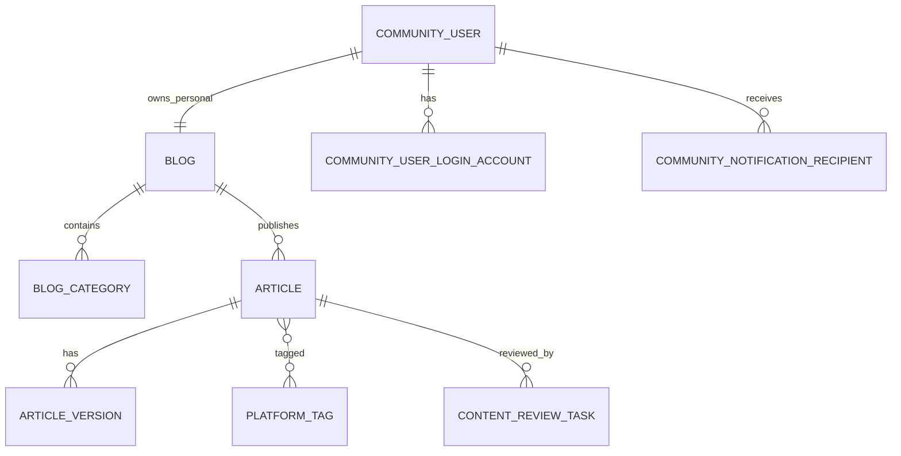

# 07 数据模型与核心表

## 1. 技术选择

- MySQL 8.x
- `utf8mb4`
- 时间统一保存 UTC
- 核心 ID 使用 BIGINT，由后端统一生成
- 前端将 BIGINT 当字符串处理
- Redis 为可选增强，不是核心闭环强依赖

## 2. 领域划分

```text
用户与认证
博客与团队
文章与版本
分类、标签与系列
动态
评论与互动
关注与收藏
投稿与共创
审核与治理
通知
文件
运营与统计
```

## 3. 第一阶段核心表

```text
community_user
community_user_login_account
community_user_preference
blog
blog_setting
blog_category
article
article_version
platform_tag
article_tag
content_review_task
community_notification
community_notification_recipient
file_object（复用 `pxczxn-admin` 文件能力）
community_file_reference
```

## 4. 核心字段摘要

### community_user

账号主体、用户名、账号状态、个人博客 ID、认证状态、发布/评论限制和登录时间。

### community_user_login_account

登录方式、规范化标识、密码哈希或第三方凭据。V1 只启用邮箱密码。

### blog

博客类型、所有者、名称、slug、简介、头像、背景图、状态和公开计数。

### article

博客、实际作者、当前版本、公开版本、标题、slug、分类、系列、可见性、发布状态、审核状态、发布时间和互动计数。

### article_version

版本号、内容模式、主内容源、渲染 HTML、纯文本、目录、内容哈希、字数、阅读时间和创建方式。

### content_review_task

审核对象、固定版本、阶段、类型、状态、风险等级、提交人、处理人和审核结果。

## 5. 关键关系

```text
CommunityUser 1—1 PersonalBlog
CommunityUser N—N TeamBlog（通过 team_member）
Blog 1—N Article
Article 1—N ArticleVersion
Blog 1—N Category
Article N—N PlatformTag
Article N—1 Series
Content 1—N Comment
User N—N ContentInteraction
Article N—N Collaborator
Article N—N RepostBlog
```

## 6. 关键唯一约束

- `community_user.username`
- 登录账号类型 + 规范化标识
- `blog.slug`
- `team_member(blog_id, user_id)`
- `blog_category(blog_id, slug)`
- `platform_tag.slug`
- `article_tag(article_id, tag_id)`
- 点赞、收藏、关注、评论点赞等关系的用户 + 目标唯一约束
- `article_repost(original_article_id, target_blog_id)`

## 7. 数据设计原则

- 文章正文不放主表。
- 审核和发布绑定固定版本。
- 公开地址、用户名和标题不能作为外键。
- 核心关系不能全部塞进 JSON。
- 重要业务数据逻辑删除，审核、处罚、举报和管理员日志不可被普通业务删除。
- 文件只在不存在有效引用后进入物理清理。

## 8. Mermaid ER 摘要


